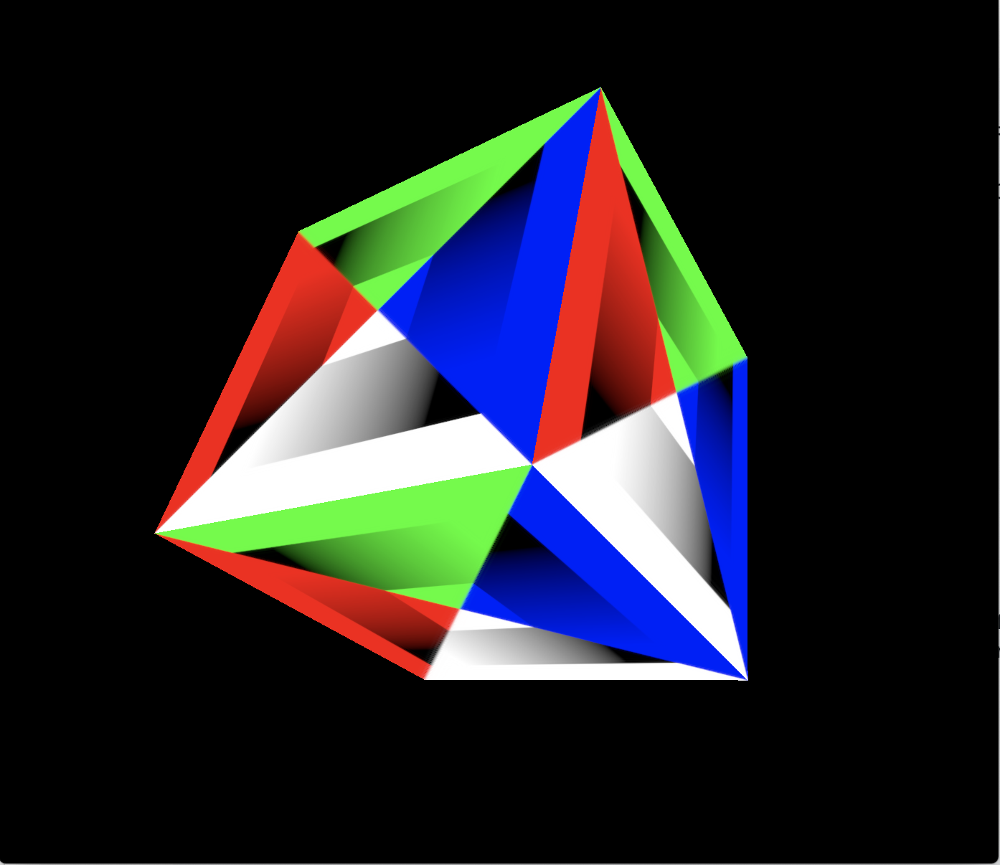

# 🔭 GPU - Cross platform GPU library (based on Metal API)

This is cross platform GPU library based on Apple's Metal API. 
Library is written in C language and it provides and will provide C API.
Since this is C API, language bindings can be written for any language.

## Status (In Progress)

I'll announce after first release is ready.

## Shading Language

I'll try to create new shading language that called ("Universal Shading Language") (https://github.com/UniversalShading).
GPU library will use that high level language for shading. Shading language will be translated/compiled into GLSL, HLSL or Metal Shaders...
Since GPU library will be cross platform, this will also make shading language cross platform... 

## Design (TODO)

GPU library provides `GPUApi` structure and headers. In theory any GPU API e.g. Metal, Vulkan, DirectX, OpenGL... could be bind this GPU library. 

Switching between GPU APIs will be easy: `GPUSwitchGPUApi(GPU_BACKEND_METAL);` or auto select `GPUSwitchGPUApiAuto()`.

This section and others will be documented in detail later...

## Design Sample

I have translated Xcode's Game template project's renderer codes into GPU library (This may be obsoleted by time):

#### - (void)viewDidLoad
```C

  GPUSwitchGPUApi(GPU_BACKEND_METAL);

  device   = GPUCreateSystemDefaultDevice();
  pipeline = GPUNewPipeline(GPUPixelFormatBGRA8Unorm_sRGB);
  library  = GPUDefaultLibrary(device);

  vertFunc = GPUNewFunction(library, "vertexShader");
  fragFunc = GPUNewFunction(library, "fragmentShader");
  vert     = GPUNewVertexDesc();

  GPUAttrib(vert, VertexAttributePosition, GPUFloat3, 0, BufferIndexMeshPositions);
  GPUAttrib(vert, VertexAttributeTexcoord, GPUFloat2, 0, BufferIndexMeshGenerics);

  GPULayout(vert, BufferIndexMeshPositions, 12, 1, GPUPerVertex);
  GPULayout(vert, BufferIndexMeshGenerics,  8,  1, GPUPerVertex);

  GPUSetFunction(pipeline, vertFunc, GPU_FUNCTION_VERT);
  GPUSetFunction(pipeline, fragFunc, GPU_FUNCTION_FRAG);
  GPUSetVertexDesc(pipeline, vert);

  GPUColorFormat(pipeline, 0, (GPUPixelFormat)_view.colorPixelFormat);
  GPUDepthFormat(pipeline, (GPUPixelFormat)_view.depthStencilPixelFormat);
  GPUStencilFormat(pipeline, (GPUPixelFormat)_view.depthStencilPixelFormat);
  GPUSampleCount(pipeline, (uint32_t)_view.sampleCount);

  renderState          = GPUNewRenderState(device, pipeline);
  depthStencil         = GPUNewDepthStencil(GPUCompareFunctionLess, true);
  depthStencilState    = GPUNewDepthStencilState(device, depthStencil);

  dynamicUniformBuffer = GPUNewBuffer(device, uniformBufferSize, GPUResourceStorageModeShared);
  commandQueue         = GPUNewCommandQueue(device);
```

#### - drawInMTKView

```C

- (void)drawInMTKView:(nonnull MTKView *)view {
  dispatch_semaphore_wait(_inFlightSemaphore, DISPATCH_TIME_FOREVER);
  
  cmdb = GPUNewCommandBuffer(commandQueue, _inFlightSemaphore, cmdOnComplete);
  
  [self _updateDynamicBufferState];
  [self _updateGameState];
  
  if ((pass = GPUPassFromMTKView(view))) {
    GPURenderCommandEncoder *rce;

    rce = GPUNewRenderCommandEncoder(cmdb, pass);
    {
      GPUSetFrontFace(rce, GPUWindingCounterClockwise);
      GPUSetCullMode(rce, GPUCullModeBack);
      GPUSetRenderState(rce, renderState);
      GPUSetDepthStencil(rce, depthStencilState);

      GPUSetVertexBuffer(rce, dynamicUniformBuffer, uniformBufferOffset, BufferIndexUniforms);
      GPUSetFragmentBuffer(rce, dynamicUniformBuffer, uniformBufferOffset, BufferIndexUniforms);
      GPUSetFragmentTexture(rce, _colorMap, TextureIndexColor);
      
      GPULoadAndDrawMTKMesh(rce, _mesh);
    }

    GPUEndEncoding(rce);
    GPUPresent(cmdb, view.currentDrawable);
  }

  GPUCommit(cmdb);
}
```

<p align="center">
   
</p>

### Trademarks

Apple name/logo and Metal are trademarks of Apple Inc. Vulkan and OpeenGL are trademarks of Khronos Group. DirectX is trademark of Microsoft Corp.
